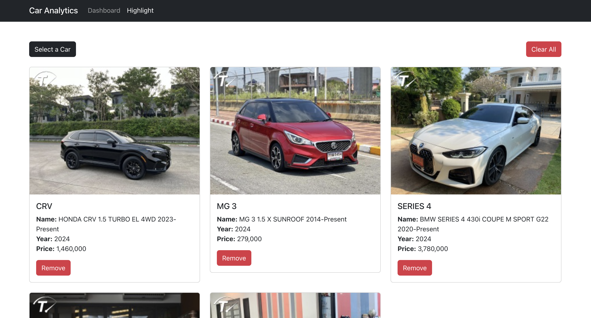

<details>
  <summary>Table of Contents</summary>
  <ol>
    <li>
      <a href="#about-the-project">About The Project</a>
      <ul>
        <li><a href="#overview">Overview</a></li>
        <li><a href="#built-with">Built With</a></li>
      </ul>
    </li>
    <li>
      <a href="#getting-started">Getting Started</a>
      <ul>
        <li><a href="#prerequisites">Prerequisites</a></li>
        <li><a href="#installation">Installation</a></li>
      </ul>
    </li>
    <li><a href="#contributors">Contributors</a></li>
  </ol>
</details>

## About The Project

The "Car Analytics" app is designed to help users visualize car inventory data. The app features a dashboard that presents car data through chart.js, making it easy to analyze various aspects of the inventory. Additionally, it includes a page for highlighting specific cars, with selected cars saved using Local Storage for persistence. The project focuses on providing a simple and effective tool for data analysis and will be deployed on GitHub Pages.

### Overview
For youtube link url please click below 
[👇](https://youtu.be/xuiyrAq9nps)
<br>
<br>
[](https://youtu.be/xuiyrAq9nps)

* Dashboard Page & Highlight Page



### Built With
This section should list any major frameworks/libraries used to bootstrap your project.

- [![React][React.js]][React-url]
- [![Bootstrap][Bootstrap.com]][Bootstrap-url]
- 

## Getting Started

This is an example of how you may give instructions on setting up your project locally.
To get a local copy up and running follow these simple example steps.

### Prerequisites
* [pnpm](https://pnpm.io/installation)

### Installation

1. Install packages
   ```sh
   pnpm install
   ```
2. Run
   ```sh
   pnpm run dev
   ```
3. Build
   ```sh
   pnpm run build
   ```
4. Preview build file
   ```sh
   pnpm run preview
   ```

### Contributors:

<a href="https://github.com/jilamikalalae">
     
</a>
<a href="https://github.com/ChetsudaP">
    
</a>
<a href="https://github.com/fewfewtobio">
         
</a>
<br>
6511063 Jilamika Lalae
<br>
6511641 Chetsuda Photiboon
<br>
6520214 Wattanan Jiratriluk

[React.js]: https://img.shields.io/badge/React-20232A?style=for-the-badge&logo=react&logoColor=61DAFB
[React-url]: https://reactjs.org/
[Bootstrap.com]: https://img.shields.io/badge/Bootstrap-563D7C?style=for-the-badge&logo=bootstrap&logoColor=white
[Bootstrap-url]: https://getbootstrap.com
