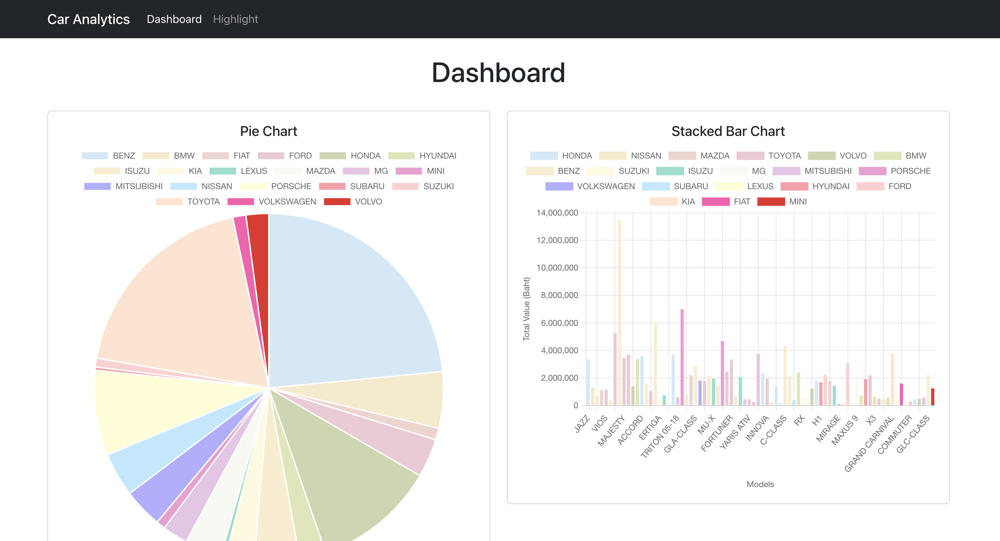

## About The Project

Dashboard Page

Hightlight Page

The "Car Analytics" app is designed to help users visualize car inventory data. The app features a dashboard that presents car data through chart.js, making it easy to analyze various aspects of the inventory. Additionally, it includes a page for highlighting specific cars, with selected cars saved using Local Storage for persistence. The project focuses on providing a simple and effective tool for data analysis and will be deployed on GitHub Pages.

## Overview

### Built With

This section should list any major frameworks/libraries used to bootstrap your project.

- [![React][React.js]][React-url]
- [![Bootstrap][Bootstrap.com]][Bootstrap-url]
- 

### Contributors:

  
 6511063 Jilamika Lalae
  
 6511641 Chetsuda Photiboon
 
6520214 Wattanan Jiratriluk

(<a href="#readme-top">back to top</a>)

[React.js]: https://img.shields.io/badge/React-20232A?style=for-the-badge&logo=react&logoColor=61DAFB
[React-url]: https://reactjs.org/
[Bootstrap.com]: https://img.shields.io/badge/Bootstrap-563D7C?style=for-the-badge&logo=bootstrap&logoColor=white
[Bootstrap-url]: https://getbootstrap.com
